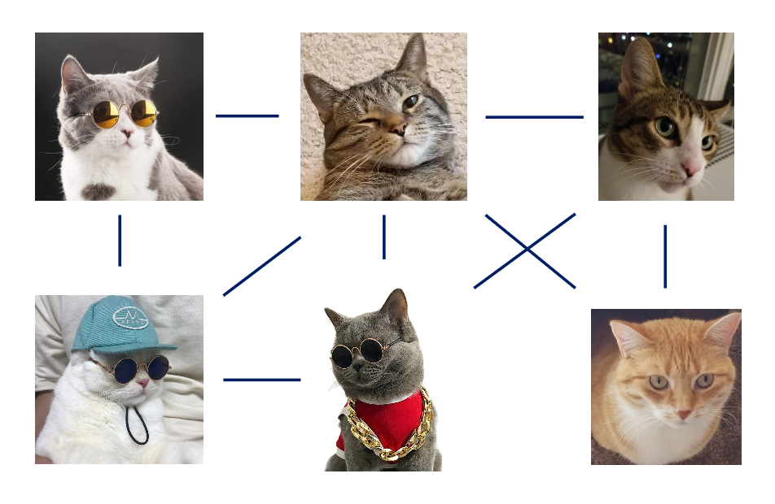
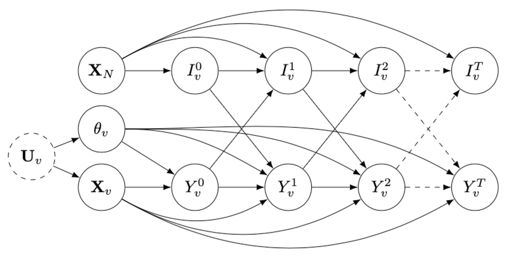
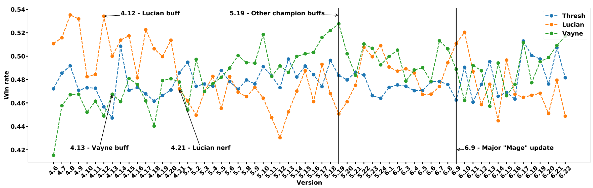
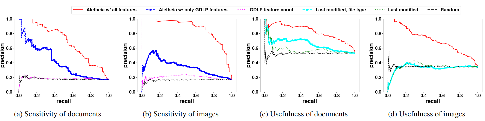
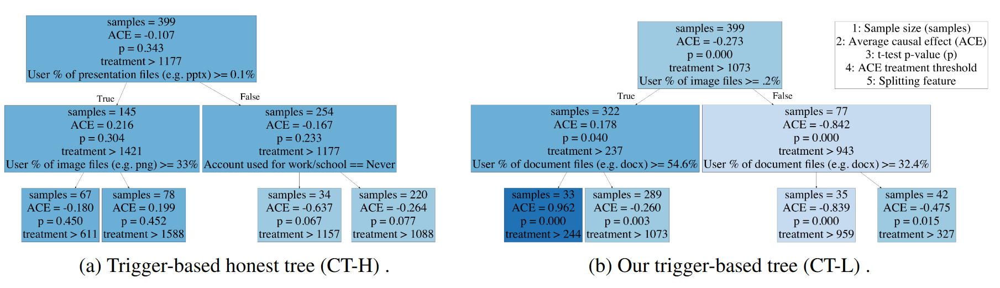

# Selected Projects

## Improving Data-driven Heterogeneous Treatment Effect Estimation Under Structure Uncertatinty

We propose a feature selection method for estimating heterogeneous treatment effects (HTE) in observational and experimental data. Unlike existing data-driven HTE estimation methods that make strong assumptions about observed features and ignore causal model structure, we consider each feature's value for HTE estimation and learn relevant parts of the causal structure from data.

[[Code]](https://github.com/edgeslab/causal_feature_selection) [[Paper]](https://dl.acm.org/doi/pdf/10.1145/3534678.3539444?casa_token=SJKBH0p_SEcAAAAA:ZtbYzbtmvKIseDgRojDmOPrkLYhfWGqIkmYcIG2sZb7EP-xWYIVidWxIuhDJ6oRu4KJVcdKqRHpIgg)

## Heterogeneous Peer Effects in the Linear Threshold Model

Our paper proposes causal inference methods for estimating individual thresholds in the Linear Threshold Model, a widely used model for describing information diffusion through a social network. Traditional applications of the model assume that all nodes have the same threshold or randomly distributed thresholds, ignoring individual-level differences. We introduce the concept of heterogeneous peer effects and develop a Structural Causal Model that supports identification and estimation of these effects.

 | 

[[Code]](https://github.com/edgeslab/hpe-ltm) [[Paper]](https://ojs.aaai.org/index.php/AAAI/article/view/20336/20095)

## Heterogeneous Effects of Software Patches in a Multiplayer Online Battle Arena Game

Our paper examines the impact of software patches on player performance and game balance in League of Legends, a popular team-based multiplayer online game. Using causal inference, we show that game patches have different impacts on players depending on their skill level and whether they take breaks between games.

[[Paper]](https://dl.acm.org/doi/pdf/10.1145/3472538.3472550)

## Helping Users Automatically Find and Manage Sensitive, Expendable Files in Cloud Storage

We propose a tool called Aletheia that helps users identify and manage sensitive, unwanted files in cloud storage. By predicting a file's perceived sensitivity and usefulness, as well as its desired management, Aletheia improves over state-of-the-art baselines and validates a human-centric approach to feature selection in security-related tasks. The tool also helps minimize the attack surface of cloud accounts, making it a valuable asset for cloud storage users concerned about their privacy and security.

[[App]](https://cloudsweeper.app/) [[Paper]](https://www.cs.uic.edu/~ctran/docs/khan-usenix2021.pdf)

## Learning Triggers for Heterogeneous Treatment Effects

We explore the problem of individual-level treatment effect differences, known as heterogeneous treatment effect estimation, where an individual-level threshold in treatment must be reached to trigger an effect. We propose a tree-based learning method to find the heterogeneity in the treatment effects and demonstrate through experimental results on multiple datasets that their approach can learn the triggers better than existing approaches.

[[Code]](https://github.com/edgeslab/CTL) [[Paper]](https://arxiv.org/pdf/1902.00087.pdf)